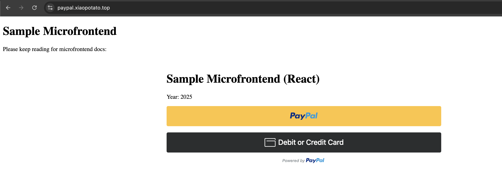

## Fastapi for Microfrontends

TLDR;

```bash
pip install -r requirements.txt
python app.py
```

You can see microfrontend docs by adding markdown files and refering to them in the `index.html`. You can see api docs by surfing to `/docs`.

# Microfrontend + FastAPI + OpenTelemetry

[Online link of Paypal Demo: https://paypal.xiaopotato.top/](https://paypal.xiaopotato.top/) 

[Online Signoz](https://s4z.xiaopotato.top/)


## 1) Frontend migration summary
We migrated the old HTML/Custom Elements app to **Vite + React**, kept PayPal Checkout, and added **OpenTelemetry Web** for traces. The React app is built into `frontend/dist` and served by **FastAPI**. Browser spans are exported via a **same-origin proxy** (`/otel/v1/traces`) to the OTLP collector, avoiding CORS and mixed-content issues.

**Highlights**
- React components: `Year`, `PayPalButton`, `MarkdownToHtml`
- Auto-instrumentation: document load, user interaction, fetch/XHR
- Same-origin OTLP proxy in FastAPI → collector at `http://10.172.27.4:4318`
- Cloudflared tunnel to expose the app/domain publicly

---

## 2) Install Node, npm (via nvm)
```bash
# Install nvm
curl -o- https://raw.githubusercontent.com/nvm-sh/nvm/v0.39.7/install.sh | bash
# restart your shell, then:
nvm install 20
nvm use 20
nvm alias default 20

node -v   # v20.x
npm -v    # 10.x
````

---

## 3) Issues we met & resolved

| Issue                                          | Cause                                             | Fix                                                                       |
| ---------------------------------------------- | ------------------------------------------------- | ------------------------------------------------------------------------- |
| `.md` files showed HTML of `index.html`        | SPA fallback served `index.html` for `/README.md` | FastAPI fallback now serves file **if exists**, else `index.html`         |
| 404 for `/README.md`, `/date.md`, `/paypal.md` | Files not in build output                         | Put docs in `frontend/public/`, rebuild                                   |
| Mixed content (HTTPS page → HTTP collector)    | Browser blocks insecure OTLP post                 | Added **backend proxy** `/otel/v1/traces` and pointed frontend to `/otel` |
| Cloudflare 502 on `otel.xiaopotato.top`        | Tunnel ingress not reaching collector             | Stopped using CF for OTLP; used backend proxy to LAN collector            |
| OTel JS version mismatch during build          | Mixed 2.x / 0.203.x / 1.36.x                      | Pinned compatible set (e.g., `1.23.0 / 0.48.0`)                           |

---

## 4) How to run the project

### Backend (FastAPI)

```bash
# create/activate venv (see section 6 for details)
python3 -m venv .venv
source .venv/bin/activate

pip install -r requirements.txt
uvicorn app:app --host 0.0.0.0 --port 8080
```

### Frontend (React)

```bash
cd frontend
npm install
npm run dev      # dev server (5173)
npm run build    # production build to frontend/dist
```

The backend serves `frontend/dist` at `/`, and API endpoints at:

* `GET /clientid`
* `POST /orders`
* `POST /capture/{order_id}`
* `POST /otel/v1/traces` (proxy to OTLP collector)

---

## 5) Persist the Python service with `screen`

Use **screen** to keep the server running after you disconnect.

### Install screen

```bash
sudo apt update
sudo apt install -y screen
```

### Basic screen usage

* **Create session:** `screen -S fastapi`
* **Detach:** `Ctrl + A`, then `D`
* **List sessions:** `screen -ls`
* **Reattach:** `screen -r fastapi`
* **Kill session:** `screen -XS fastapi quit`

### Run FastAPI in a screen session

```bash
screen -S fastapi
# inside screen:
cd /path/to/INFO8589-S25-G3-INCLASS-TASK5
source .venv/bin/activate
uvicorn app:app --host 0.0.0.0 --port 8080
# detach with Ctrl+A, D
```

---

## 6) Use Python venv to run the service

Create an isolated environment for Python deps.

```bash
# install venv support if missing (Ubuntu)
sudo apt install -y python3-venv

# create & activate
python3 -m venv .venv
source .venv/bin/activate

# upgrade pip and install
python -m pip install --upgrade pip
pip install -r requirements.txt

# run
uvicorn app:app --host 0.0.0.0 --port 8080
```

**Verify venv**

```bash
which python  # .../INFO8589.../.venv/bin/python
python -V
```

---

## 7) Expose the Python service with Cloudflared (domain: `paypal.xiaopotato.top`)

We use a **named Cloudflare Tunnel** so `https://paypal.xiaopotato.top` maps to the FastAPI server on `localhost:8080`.

### 7.1 Create/login (one-time if you haven’t)

```bash
# install cloudflared (Debian/Ubuntu)
curl -L https://github.com/cloudflare/cloudflared/releases/latest/download/cloudflared-linux-amd64.deb -o cloudflared.deb
sudo dpkg -i cloudflared.deb

cloudflared tunnel login
cloudflared tunnel create fastapi-paypal
```

This prints a **Tunnel ID** and puts credentials in `~/.cloudflared/<TUNNEL_ID>.json`.

### 7.2 Configure `/etc/cloudflared/config.yml`

Add a hostname that points to your FastAPI app (keep 404 last; order matters):

```yaml
tunnel: <YOUR-TUNNEL-ID>
credentials-file: /home/ubuntu/.cloudflared/<YOUR-TUNNEL-ID>.json

ingress:
  - hostname: paypal.xiaopotato.top
    service: http://localhost:8080

  # (existing)
  - hostname: codespace.xiaopotato.top
    service: http://localhost:4180
  - hostname: codespace-dev.xiaopotato.top
    service: http://localhost:8088

  - service: http_status:404
```

### 7.3 Route DNS to the tunnel

Rich's video: Set truenas + cloudflared + custom domain: Week 6 Container orchestration - Security [video 1/2/3]

```bash
cloudflared tunnel route dns <YOUR-TUNNEL-ID> paypal.xiaopotato.top
```

### 7.4 Start/Restart the tunnel service

```bash
sudo cloudflared service install        # installs systemd unit if not present
sudo systemctl restart cloudflared
sudo systemctl status cloudflared
journalctl -u cloudflared -f
```

### 7.5 Verify

```bash
curl -I https://paypal.xiaopotato.top/
curl -I https://paypal.xiaopotato.top/clientid
```

You should see `200 OK` from FastAPI.

> **Tip:** Keep using the backend OTLP proxy (`POST /otel/v1/traces`) so the browser sends traces to the same origin (`paypal.xiaopotato.top`) and the server forwards them to your LAN collector (`http://10.172.27.4:4318`). This avoids TLS/CORS headaches.

---

## 8) Environment variables (summary)

* `VITE_OTLP_BASE` (frontend) — default `/otel`
* `OTEL_EXPORTER_OTLP_TRACES_ENDPOINT` (backend) — default `http://10.172.27.4:4318/v1/traces`
* `PAYPAL_CLIENT_ID`, `PAYPAL_CLIENT_SECRET` — set in `.env` for FastAPI

---

## 9) Project layout

```
.
├─ app.py                        # FastAPI app (serves React + API + OTLP proxy)
├─ requirements.txt
├─ .env
├─ frontend/
│  ├─ public/                    # README.md, date.md, paypal.md
│  ├─ src/                       # React app (incl. otel-init.js)
│  └─ dist/                      # build output served by FastAPI
└─ .devcontainer/                # dev container config (optional)
```
